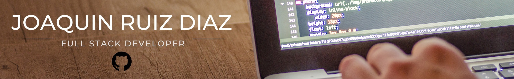

 

  

 

# Tech Skills

### Front End Developer | Next.js | React | Redux | NodeJS | JavaScript | TypeScript | ReduxToolkit |

# About me

###

🧑🏻‍💻 Soy Front-end Developer con background en Administración y Contabilidad. Tengo experiencia en JavaScript, TypeScript, Next.JS, React, Redux, Redux Toolkits, NodeJS, Bootstrap y Figma.

👨🏻‍🎓 Mi formación es Full Stack Web Developer, por lo que cuento con experiencia en back-end con ExpressJS y en base de datos con MongoDB, PostgreSQL, Sequelize.

🔗 Tengo amplio conocimiento en herramientas colaborativas y manejo de ramas con Git y GitHub, y he trabajado en equipos ágiles usando metodologías Scrum

🤳 En mis proyectos, he trabajado en el diseño y desarrollo de aplicaciones interactivas, utilizando componentes basados en estándares para garantizar la calidad y la compatibilidad de la aplicación y siempre pensando en la experiencia del usuario.

👥 Soy una persona comunicativa, analítica, organizada, con alto nivel de adaptabilidad y que disfruta el trabajo en equipo. Me mantengo en continua búsqueda por desarrollarme incorporando nuevos conocimientos, tecnologías y metodologías de trabajo eficientes.

🗣️ Tengo fluidez en el idioma portugués y manejo básico del idioma inglés, pero estoy estudiando para seguir mejorando.

📩 Si te gustó mi perfil, contactame por e-mail o Linkedin

## Contacto

###

Email: joaquing.ruizdiaz@gmail.com
